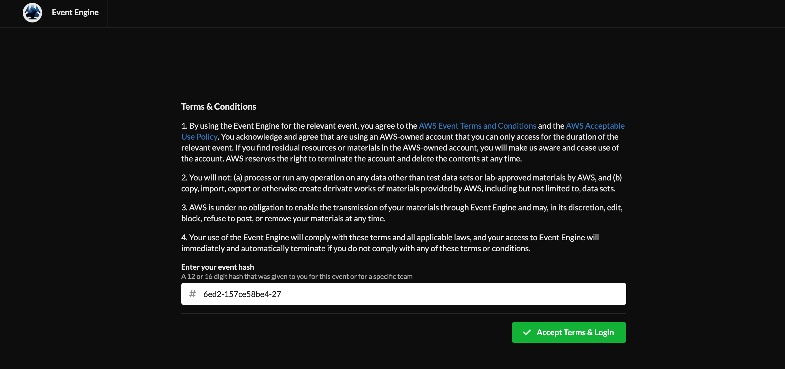
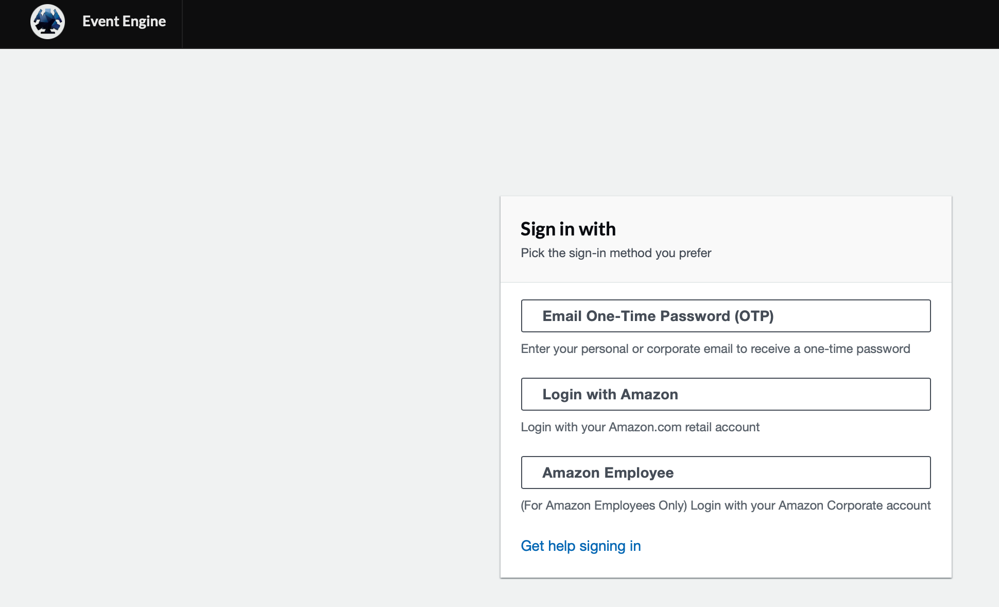
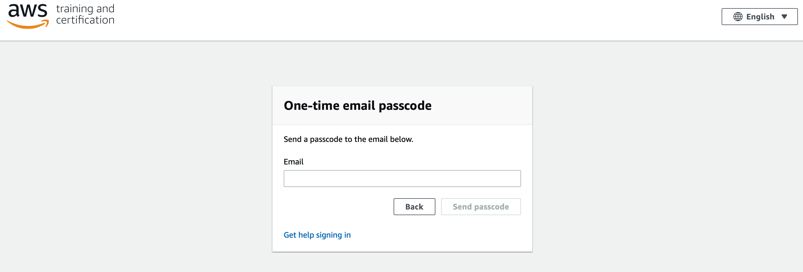
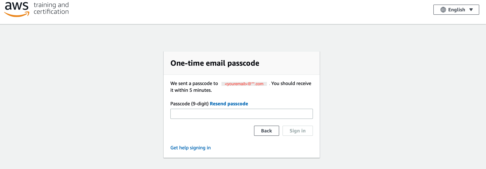
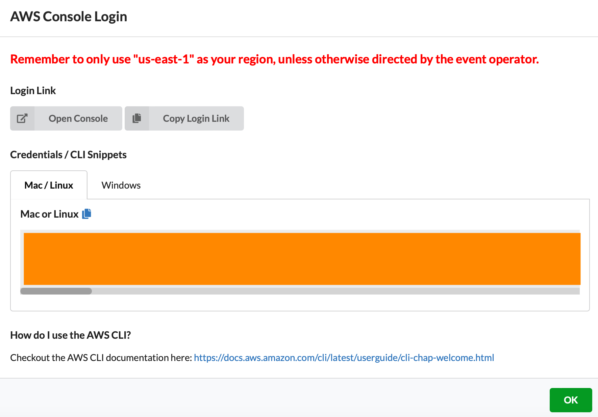

# Workshop Execution Steps

## Set up AWS Accounts

Login to AWS Workshop Portal by clicking the link https://bit.ly/aws-access

The following screen shows up.

 
   

3 Click on Accept Terms & Login button to continue the next screen below.

 
  

4 Click on "Email One-Time Password(OTP)" and enter your email and click on "Send passcode" as below. 

 
   

5 Enter the 9 digit passcode that you recieve in your email and click "Sign in"

 
   

6 Click on "AWS Console" button 

 
   

7 Take the defaults and click on "Open Console". This will open AWS Console in a new browser tab.

 
   
