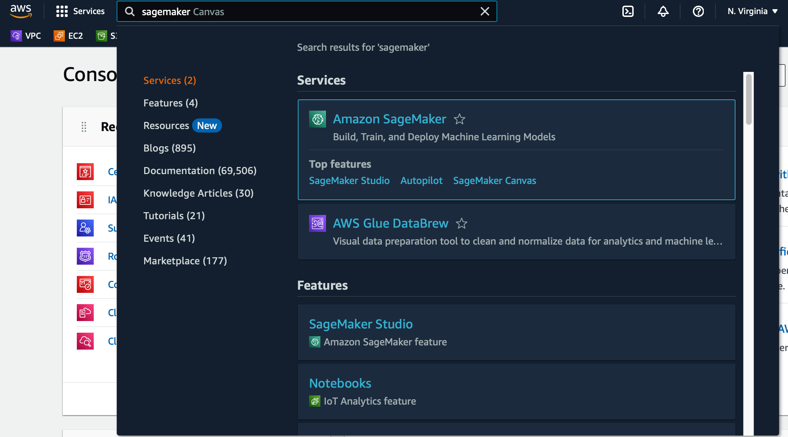
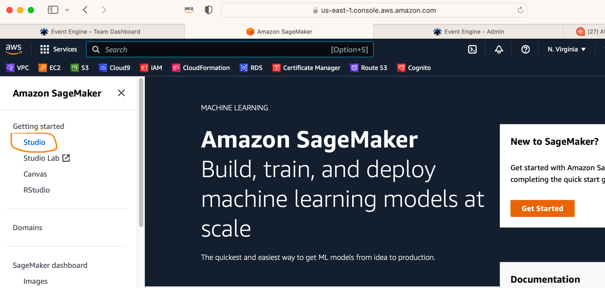
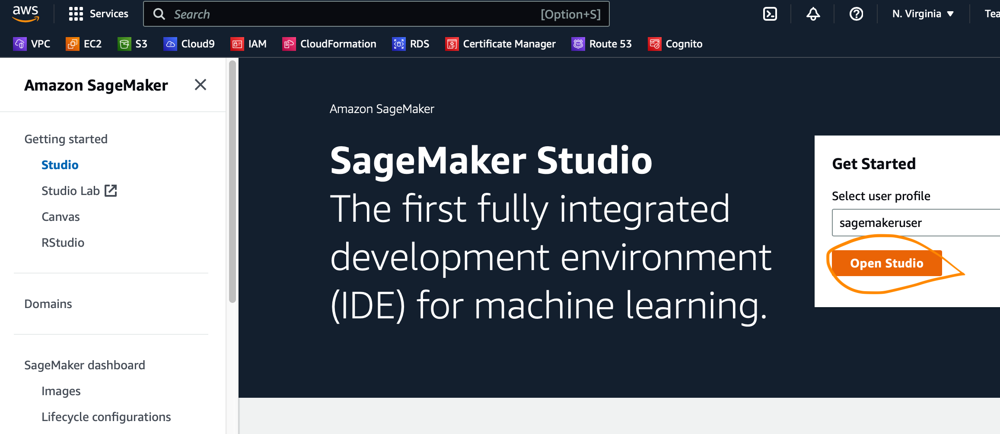
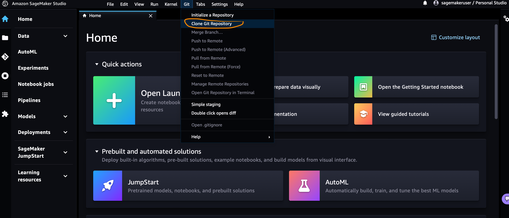
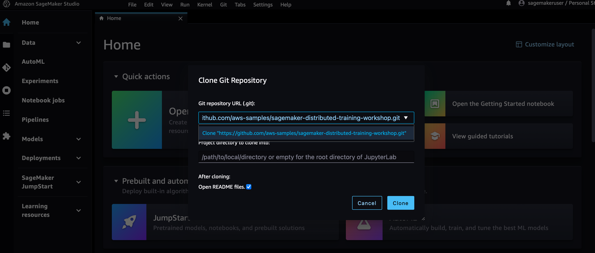
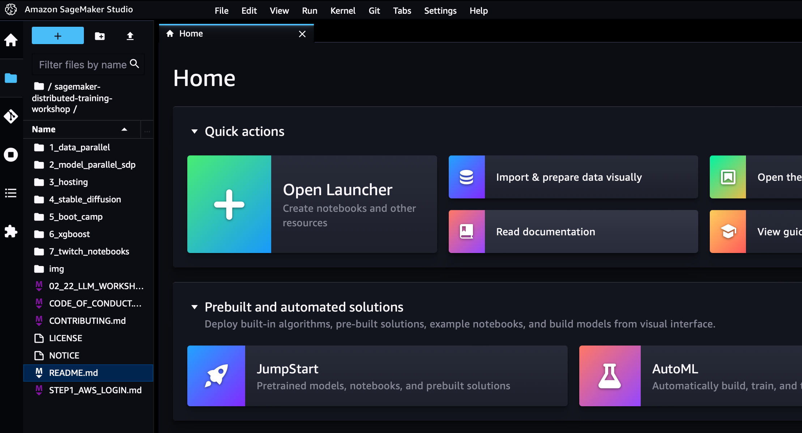

## Login to Amazon SageMaker Studio

1. Search "SageMaker" in top search bar and click on Amazon SageMaker link 

 
   

2. From SageMaker home page, click on "Studio" link in left navigation

 
   

3. Click on Open Studio

 
   

4. From SageMakwer Studio menu, click on "Clone Git Repository"

 
   

5. Enter following git url "https://github.com/aws-samples/sagemaker-distributed-training-workshop.git" and click "Clone"

 
   

6. Access your labs from the folder in left navigation

 
   

